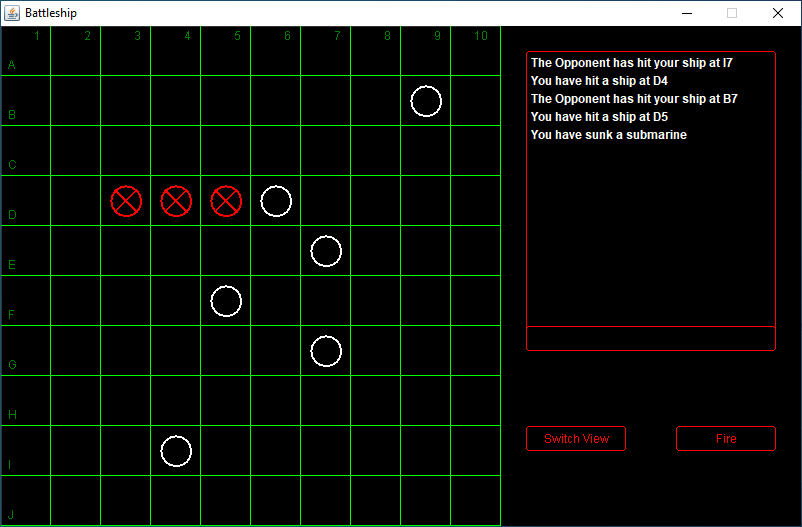

# Battleship
Made for AP Computer Science A

 

**Ship placing screen**

 

**Torpedo targeting and firing screen**

 

**Current status of the player's ship class**

## Features
- [x] Abstract ship object class w/ instance variables for size
- [x] Inherited children for ship types (Carrier, Battleship, Cruiser, Submarine, Destroyer)
- [x] 10 by 10 2D primitive integer arrays to represent ship positions
- [x] A grid class that extends a JPanel w/ a GridLayout that displays the 2D arrays
- [x] Fully functional interface w/ draggable ships and accurate displaying of the 2D arrays
- [X] Singleplayer mode with computer that takes random shots to play against
- [ ] Multiplayer mode that can connect via LAN and use a simple universal language to communicate w/ other Battleship clients
