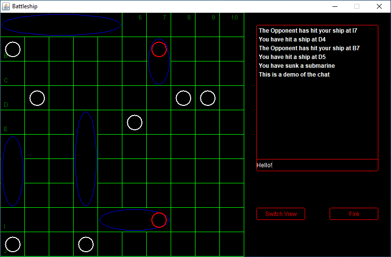

# Battleship
Made for AP Computer Science A

  
 

## Features
- [x] Abstract ship object class w/ instance variables for size
  - Inherited children for ship types (Carrier, Battleship, Cruiser, Submarine, Destroyer)
- [x] 10 by 10 2D primitive boolean array for the player to arranges ships and displays the shots by the opponent
  - False equals a ship is not at that position and true equals a ship is at that position
- [x] 10 by 10 2D boxed Boolean array for the player to display their own shots.
  - Null equals that position is unknown, false equals that postition is empty or is around a destroyed ship, and true equals that position has a ship
- [x] A grid class that extends a JPanel w/ a GridLayout that displays the 2D arrays
  - Method to add a ship object to a 2D array at a position (e.g.: x.add(Ship ship, Position position)
- [x] Fully functional interface w/ draggable ships and accurate displaying of the 2D arrays
- [X] Singleplayer mode with computer to play against computer
- [ ] Multiplayer mode that can connect via LAN and use a simple universal language to communicate w/ other Battleship clients
